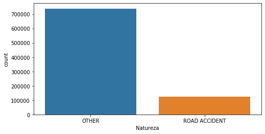

# LEI
This project's main goal is to apply machine learning to road accident predictions using aerial or satellite imagery in the Portuguese mainland. The strategy used consisted of dividing the area of study in 200mx200m squares and use the data taken from the <em>Autoridade Nacional da Proteção Civil</em>(Portugal)[^1] API and downloaded using the tools made available in this repository[^2].
The data gathered consisted of occurrences of various accidents in the Portuguese mainland from early 2016 to march 2020. The incidents not directly related to road accident risk were removed from the gathered dataset and the resulting dataset was cleaned and processed to allow for easier used and data exploration.

*areas whith 0(green),1(yellow) ,2(orange),3(red),4(grey),5 or more accidents(black)*

*Benfica stadium as reference for what a 200mx200m cell looks like*

The resulting dataset was then used to create a dataset distinguishing between the cells where accidents occurred in the given timeframe and another dataset used to divide the cells where accidents occurred in three different levels. Both the datasets were balanced to avoid potential problems related to overfitting. 

*Number of cells having road containing and not containing accidents in the given period*

Having created the datasets the aerial imagery was downloaded using the bing maps API[^3] and the watermark cut and images resized to 128x128.

 
*satellite imagery taken from the bing maps API original vs resized*

Using these images we trained and validated some deep learning models for each of the datasets and got the following results.

*metrics for the first dataset without transfer learning for the different deep learning architectures*

*metrics for the first dataset with transfer learning for the different deep learning architectures*

*metrics for the second dataset without transfer learning or data augmentation for the different deep learning architectures*

*metrics for the second dataset with transfer learning or data augmentation for the different deep learning architectures*

We also used the trained models to implement a couple of proof of concepts that show some of the possible use cases for the created models, this use cases include a REST API that predicts the risk associated with the given coordinates and a library capable of generating RiskMaps for a given GeoJson specification file,a given area RiskMaps consists in a GeoTiff file containing colorations according to the risk of each of the portions of the map.

 
*Sattelite imagery of an area in the Braga district and its associated RiskMap*

[^1]:http://www.prociv.pt/en-us/Pages/default.aspx
[^2]:https://github.com/centraldedados/protecao_civil
[^3]:https://www.bing.com/maps

## Image datasets
+ First Dataset-contains images of areas with and without accidents
  + [ACCIDENTS](https://drive.google.com/open?id=1eZD8lV-gBML8tAkEMPHU8T52cFtBLr79)
  + [SAFE](https://drive.google.com/open?id=1S17bGUjrhr_VWDlPLpXLXQcqp66xc_Rg)
  + [READY TO TRAIN DATASET](https://drive.google.com/file/d/1EKxK7JfHm3YCJq6BBAHP1cNMp5uNhryI/view?usp=sharing) - images already separated into testing and training folders
+ Second Dataset-This dataset containg images of areas having various levels of risk depending on the number of accidents that occured during a given time frame
  + [Level1](https://drive.google.com/open?id=1nWbAyEYpG1wJLyF3dPPmllQyhvvQXQlX)
  + [Level2](https://drive.google.com/open?id=1jpADDXi2ldW3vGW9GUadsMDfhkMT_kOw)
  + [Level3](https://drive.google.com/open?id=1eNcOVIlH17zaIAGixlfYxei9iC45vSSS)
  + [READY TO TRAIN DATASET](https://drive.google.com/file/d/1Nn06pTEu9YdxRkiLoi-IqSPG8L7UFCvj/view?usp=sharing) - images already separated into testing and training folders

## CSV dataframes
+ [Data gathered from the Portuguese National Emergency and Civil Protection Authority](https://drive.google.com/file/d/1teptrQVC6wLZLk-3Njc4XSONLEpYd5-J/view?usp=sharing) this dataset contains a wide array of accidents and events both traffic and non-traffic related taking place from 1/01/2016 to 24/03/2020
+ [Grid Accidents](https://drive.google.com/file/d/178s7Y8AG7z0OBLHkceR3XiBNX543PzRs/view?usp=sharing) Using the data in the dataset above we extracted the traffic accidents and created this dataset containing the number of accidents in each 200x200m in mainland Portugal.
+ [Portugal District](https://idealista.carto.com/tables/distritos_portugal/public) This GeoJson file containing delimitations of mainland Portuguese districts.
+ [MODEL1](https://drive.google.com/file/d/1QF5vVQ13BBjT6vR7PNIMry7fpgWXBbQS/view?usp=sharing) Contains around 30335 200x200m  grid cells where 1 ore more accidents occurred in the above time frame and 37000 where none occurred.
+ [MODEL2](https://drive.google.com/file/d/12LRtOOdTz66E_K7Fo6Jl1VL6Da76M3mi/view?usp=sharing) Contains 30335 grid cells where accidents occurred in the given dataset divided into 3 danger categories according to their accident count.